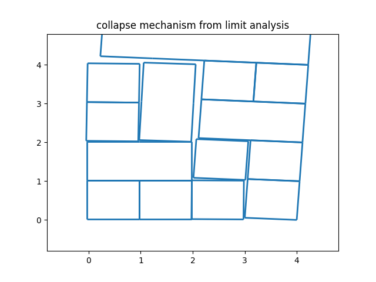

# Rigid block modeling of masonry structures using mathmatical programming
This is a reproduced work of the article [Rigid block modelling of historic masonry structures using mathematical programming: a unified formulation for non‑linear time history, static pushover and limit equilibrium analysis][Francesco 2019] and [A variational rigid-block modeling approach to nonlinear elastic and kinematic analysis of failure mechanisms in historic masonry structures subjected to lateral loads][Francesco et al. 2021].

All the scripts are self containing, without importing functions from anothers.

## Benchmarks comparing current implementation and those in the literature

### Benchmark 1: static pushover analysis and limit analysis of a single rigid block

*mono_wall_pushover.py*

This benchmark is originally proposed by [Francesco][Francesco 2019]. We compare here the pushover curve (load multiplier versus displacement of the top right corner node) shown in [Figure 7(b)][Francesco 2019]. The reproduced result is shown below:

The pushover curve compares fairly well with the reference, as well as the initial critical load multiplier. The slope obtained here is slightly sharper. It could be ascribed to the different solution strategy of the kinematic variables. The implementation here actually solves both [equation 29][Francesco 2019] and [equation 30][Francesco 2019]. But in the article, only [equation 29] is solved and kinematic variables are obtained from Lagrange multipliers associated with the corresponding problem constraints.

### Benchmark 2: limit analysis of two leaves masonry walls

This benchmark is to show the impact of number of headers of two leaves masonry walls on the load multiplier of the initial configuration. The two walls studied here are shown in [Figure 11(a)][Francesco 2019] and [Figure 11(b)][Francesco 2019]. The value obtained ...

### Bemchmark 3: static pushover of masonry walls

*example_1_pushover.py*

This benchmarks is originally proposed by [Francesco][Francesco et al. 2021] in 2021. The collapse mechanism obtained is shown below:

The pushover curve from the rigid contact model is:

The differences in modelling are noted here:

- The original article used rounded blocks.
- The original article used Lagrange multiplier to obtain kinematic variables. The same difference is observed in benchmark 1.

But in the work of [Gilbert in 2006][Gilert et al. 2006] and [Ferris in 2001][Ferris and Tin-Loi 2001] where the same wall geometry is studied using rigid modeling, the collapse load multiplier of the initial configuration compares well with my implementation, which is around 0.64.

[Francesco 2019]: https://link.springer.com/article/10.1007/s10518-019-00722-0
[Francesco et al. 2021]: https://onlinelibrary.wiley.com/doi/full/10.1002/eqe.3512
[Gilert et al. 2006]: https://www.sciencedirect.com/science/article/abs/pii/S0045794906000356
[Ferris and Tin-Loi 2001]: https://www.sciencedirect.com/science/article/pii/S0020740399001113?via=ihub#FIG3

### Benchmark 4: Dry joint stone shear walls *not finished*

*shear_wall.py*

This benchmark is from the experiments conducted by Lourenço et al.. It is then modelled with rigid blocks by [Francesco][Francesco et al. 2021] (Figure 8).

## Studies using current implementation

### Study 1: Limit analysis of 4*4 wall, tilting table load

*grid4_la.py classical*
*grid4_la.py efficient*

The gloabal mechanical performance of a brick masonry wall can be evaluated by calculating the collapse angle of tilting test using limit analysis. The reinforcement learning agent suggests that interlocking in the first two courses does not win extra gain in global mechanical performance of a 4*4 wall. We hereby investigate the collapse mechanism corresponding to two layouts in the tilting test.

The classical layout and its collapse mechanism is shown as below. The load multiplyer is 0.58.

 

The efficient layout and its collapse mechanism is shown as below. The load multiplyer is also 0.58. It is named as 'efficient' because less brick is used to fill up the space.

 

It can be seen that sliding failure happen to both layouts. For classical layout, the surface between the second course and the third course fails. For efficient layout, the bottom surface fails.

### Study 2: Limit analysis of 4*4 wall, cantilever load

*grid4_canti_3layouts.py classical/efficient/efficientPro*

The same wall in study 1 is charged with a cantilever loading, with veritcal load being 6 times the weight of the wall (scale refered from [Lourenco et al. 2005][https://ascelibrary.org/doi/pdf/10.1061/%28ASCE%290733-9445%282005%29131%3A11%281665%29]).

The classical layout has the highest collapse load, 11.92(unit weight). The collapse mechanism is shown below:

The efficient layout has the smallest collapse load, 11.58(unit weight). But the difference is not remarkeble. Below is its collapse mechanism:

Another layout has the most efficiency, with the least number of actions to fill the wall. Its collapse load is 11.72(unit weight). The collapse mechanism is:

More configurations and their load multiplier:
11.305555555555559

11.04310344827586

10.967432950191572

10.967432950191577

10.544464609800363
